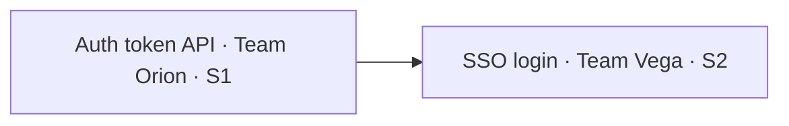

# Dependency Mapper

## Steps

1. Read the stories or features. With Atlassian MCP, also read `is blocked by` and `depends on` links.
2. With `@workspace`, check shared modules, API contracts and migrations that more than one story touches.
3. For each dependency record: upstream (what's needed), downstream (who needs it), teams, needed-by sprint, risk (Low/Med/High), and a suggested resolution.
4. Flag **critical path** chains of 3 or more stories and anything needed in the same sprint it is produced.
5. Stop at the Review Gate. Dependencies are only "agreed" once the other team confirms, which the reviewer records.

## Output

| # | Upstream | Downstream | Teams | Needed by | Risk | Resolution | Status |
|---|---|---|---|---|---|---|---|

Then a Mermaid graph of the critical path:

## Guardrails

- "Status" starts as `Proposed`. Only the reviewer can change it to `Agreed`.
- Same-sprint dependencies are always rated at least Medium.
